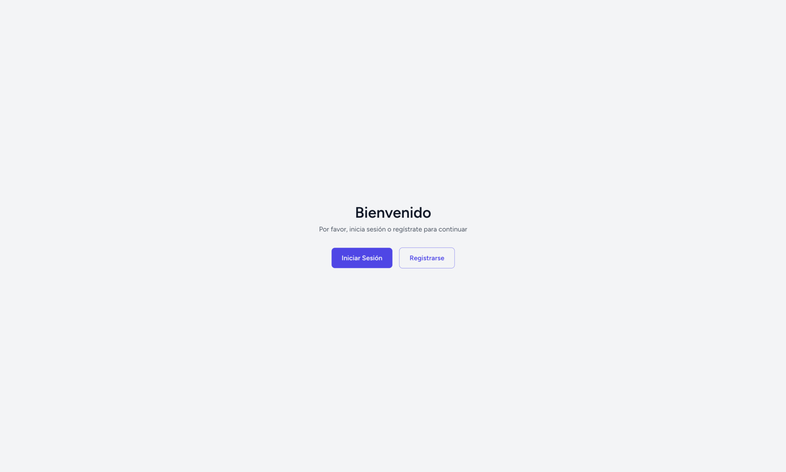

<p align="center">
  <h1 align="center">Sistema de Autenticación Laravel + Vue</h1>
  
</p>

<p align="center">
  
  
  
  
</p>

## 📝 Descripción

Sistema de autenticación moderno y seguro desarrollado con Laravel 11 y Vue 3, utilizando SQLite como base de datos. Este proyecto implementa un sistema completo de registro y autenticación de usuarios con una interfaz limpia y minimalista.

## ✨ Características Principales

- 🔐 Autenticación segura con Laravel Breeze
- 📱 Diseño minimalista y responsive
- ✅ Validación en tiempo real de formularios
- 🎨 Interfaz construida con Vue 3 y TailwindCSS
- 📦 Base de datos SQLite para fácil configuración
- 🔒 Protección CSRF integrada

## 🛠️ Tecnologías Utilizadas

- **Laravel 11** - Framework Backend
- **Vue 3** - Framework Frontend
- **TailwindCSS** - Framework CSS
- **SQLite** - Base de Datos
- **Laravel Breeze** - Starter Kit de Autenticación
- **Vite** - Build Tool

## 📋 Requisitos Previos

- PHP >= 8.2
- Composer
- Node.js >= 16.x
- npm
- SQLite

## ⚙️ Instalación

1. **Clonar el repositorio**
```bash
git clone git@github.com:Hernan-21/Auth-System.git
cd auth-system
```

2. **Instalar dependencias de PHP**
```bash
composer install
```

3. **Instalar dependencias de Node.js**
```bash
npm install
```

4. **Configurar el entorno**
```bash
cp .env.example .env
php artisan key:generate
```

5. **Configurar la base de datos SQLite**
```bash
touch database/database.sqlite
```

6. **Actualizar el archivo .env**
```env
DB_CONNECTION=sqlite
DB_DATABASE=/ruta-absoluta/auth-system/database/database.sqlite
```

7. **Establecer permisos**
```bash
chmod -R 775 storage bootstrap/cache
chmod 666 database/database.sqlite
```

8. **Ejecutar migraciones**
```bash
php artisan migrate:fresh
```

## 🚀 Ejecución del Proyecto

1. **Iniciar el servidor de Laravel**
```bash
php artisan serve
```

2. **En otra terminal, compilar assets**
```bash
npm run dev
```

El proyecto estará disponible en: [http://localhost:8000](http://localhost:8000)

## 📁 Estructura del Proyecto

```plaintext
/app
  /Http
    /Controllers      # Controladores de la aplicación
  /Models            # Modelos de datos
/resources
  /js
    /Pages          # Componentes Vue principales
      /Auth         # Componentes de autenticación
      /Profile      # Componentes de perfil
    /Components     # Componentes Vue reutilizables
/database
  /migrations       # Migraciones de la base de datos
```

## 🔐 Características de Seguridad

- Autenticación robusta mediante Laravel Breeze
- Protección CSRF en todos los formularios
- Validación de datos en frontend y backend
- Encriptación de contraseñas con bcrypt
- Manejo seguro de sesiones

## 🛣️ Rutas Principales

| Ruta | Descripción |
|------|-------------|
| `/` | Página de inicio |
| `/login` | Inicio de sesión |
| `/register` | Registro de usuario |
| `/profile` | Perfil de usuario |
| `/dashboard` | Panel principal |

## ⚠️ Solución de Problemas Comunes

1. **Error de permisos en storage**
```bash
chmod -R 775 storage
chmod -R 775 bootstrap/cache
```

2. **Error en la base de datos**
```bash
rm database/database.sqlite
touch database/database.sqlite
chmod 666 database/database.sqlite
php artisan migrate:fresh
```

3. **Limpiar caché**
```bash
php artisan config:clear
php artisan cache:clear
php artisan view:clear
```

## 🤝 Contribuir

1. Fork el proyecto
2. Crea tu rama de características
   ```bash
   git checkout -b feature/NuevaCaracteristica
   ```
3. Commit tus cambios
   ```bash
   git commit -m 'Add: nueva característica'
   ```
4. Push a la rama
   ```bash
   git push origin feature/NuevaCaracteristica
   ```
5. Abre un Pull Request

## 👨‍💻 Autor

**Hernán Naguibin**
- GitHub: [@Hernan-21](https://github.com/Hernan-21)

## 📄 Licencia

Este proyecto está bajo la Licencia MIT - ver el archivo [LICENSE.md](LICENSE.md) para más detalles.

## 🔗 Enlaces Útiles

- [Repositorio del Proyecto](https://github.com/Hernan-21/Auth-System)
- [Reportar un Bug](https://github.com/Hernan-21/Auth-System/issues)
- [Laravel Documentation](https://laravel.com/docs)
- [Vue Documentation](https://vuejs.org/)
- [TailwindCSS Documentation](https://tailwindcss.com/docs)

---
<p align="center">
  Desarrollado con ❤️ por Hernán Naguibin
</p>
</p>